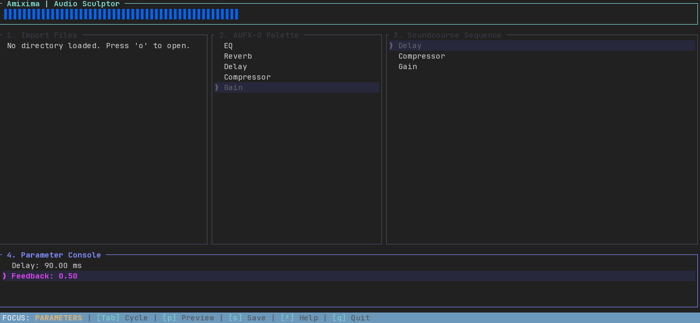

# Amixima

Amixima is a Terminal User Interface (TUI) tool for audio "sculpting" and batch processing. It allows musicians and sound engineers to define a sequence of audio effects (a "Soundcourse") and apply them to multiple audio files efficiently.

## Features

- **TUI Interface**: Fast, keyboard-driven workflow.
- **Soundcourse Ontology**: Define reusable effect chains in JSON-LD or INI formats.
- **Batch Processing**: Apply your effect chains to entire directories of WAV files.
- **Core Effects**:
  - EQ (Biquad Filter)
  - Reverb (Parallel Comb Filters)
  - Delay (Feedback Delay)
  - Compressor (Peak detection)

## Getting Started

### Installation

Ensure you have Rust and Cargo installed.

```bash
cargo install --path .
```

### Usage

Run the application:

```bash
amixima
```

Or open a specific directory:

```bash
amixima /path/to/my/samples
```

### Controls

| Key | Action |
|-----|--------|
| `Tab` | Cycle through panes (Files, Palette, Sequence, Parameters) |
| `↑/↓` | Navigate lists |
| `Enter` | Select file / Add effect |
| `Shift + ↑/↓` | Reorder effects in Sequence |
| `d` | Delete selected effect |
| `←/→` | Adjust parameters (in Parameter Console) |
| `Ctrl + Enter` | Apply Soundcourse to all WAVs in current directory |
| `s` | Save Soundcourse |
| `?` | Show Help (WIP) |
| `q` | Quit |

## Roadmap

- [ ] Support for more audio formats (MP3, FLAC, OGG) via Symphonia.
- [ ] Real-time audio preview.
- [ ] Improved Reverb and Delay algorithms.
- [ ] Peak visualization.
- [ ] Plugin support (VST/AU).

## License

MIT
