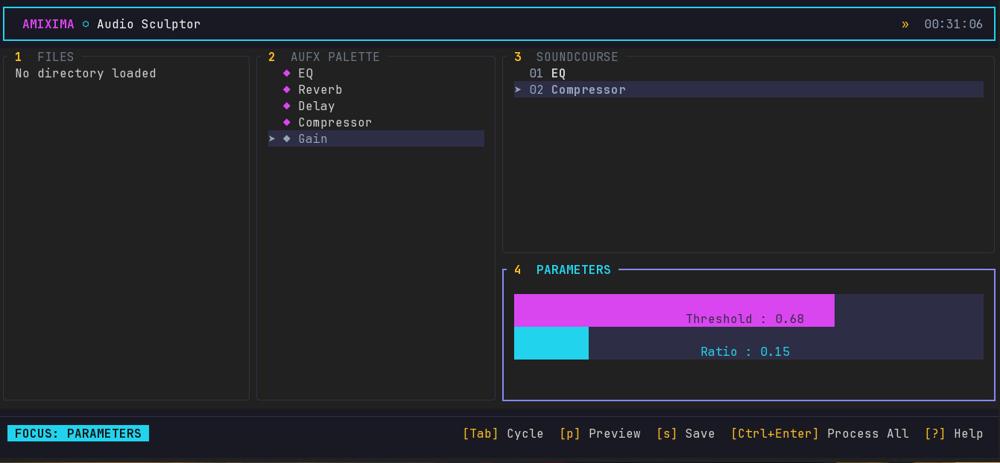
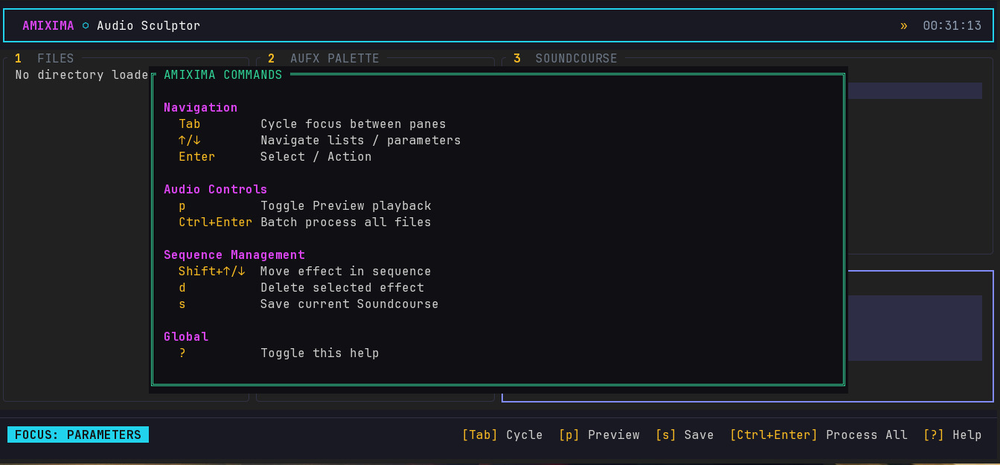

# Amixima




Amixima is a Terminal User Interface (TUI) tool for audio "sculpting" and batch processing. It allows musicians and sound engineers to define a sequence of audio effects (a "Soundcourse"), preview that chain against selected audio, and apply it to a directory of WAV files.

## Features

- **TUI Interface**: Fast, keyboard-driven workflow.
- **Soundcourse Ontology**: Define reusable effect chains in JSON-LD or INI formats.
- **Batch Processing**: Apply your effect chains to entire directories of WAV files.
- **Preview Playback**: Preview the selected audio file through the current Soundcourse.
- **Core Effects**:
  - EQ (Biquad Filter)
  - Reverb (Parallel Comb Filters)
  - Delay (Feedback Delay)
  - Compressor (Peak detection)
  - Gain

## Getting Started

### Installation

Ensure you have Rust and Cargo installed.

```bash
cargo install --path .
```

### Usage

Run the application:

```bash
amixima
```

Or open a specific directory:

```bash
amixima /path/to/my/samples
```

You can also launch the TUI explicitly:

```bash
amixima tui /path/to/my/samples
```

Use the CLI for non-interactive workflows:

```bash
amixima validate examples/warm-bus.ini
amixima inspect examples/warm-bus.jsonld
amixima list-effects
amixima apply --course examples/warm-bus.ini --input /path/to/wavs
```

Load an example Soundcourse by copying or opening one of:

```bash
examples/warm-bus.ini
examples/spacious-delay.jsonld
```

### Supported Files

- Batch export is stable for WAV input and always writes WAV output.
- Preview uses Symphonia decoding and may work with MP3, FLAC, OGG, M4A, and AIFF depending on the local codec path.
- Soundcourses can be loaded from `.ini`, `.json`, or `.jsonld` files.
- Saved Soundcourses default to `.jsonld` unless the filename ends in `.ini`, `.json`, or `.jsonld`.

### First Workflow

1. Start Amixima with `amixima /path/to/wavs`.
2. Press `Tab` to move to the AUFX palette.
3. Select an effect and press `Enter` to add it to the Soundcourse.
4. Move to Parameters and adjust values with `←/→`.
5. Select an audio file and press `p` to preview.
6. Press `s` to save the Soundcourse.
7. Press `Ctrl + Enter` to process all WAV files in the current directory.

Processed files are written to `output/` under the current directory. Existing processed files are not overwritten; Amixima appends a numeric suffix when needed.

### Controls

| Key | Action |
|-----|--------|
| `Tab` | Cycle through panes (Files, Palette, Sequence, Parameters) |
| `↑/↓` | Navigate lists |
| `Enter` | Select file / Add effect |
| `Shift + ↑/↓` | Reorder effects in Sequence |
| `d` | Delete selected effect |
| `←/→` | Adjust parameters (in Parameter Console) |
| `Ctrl + Enter` | Apply Soundcourse to all WAVs in current directory |
| `s` | Save Soundcourse |
| `o` | Open a directory by path |
| `p` | Toggle preview playback |
| `?` | Show Help |
| `q` | Quit |

## Troubleshooting

- If preview fails with `no output device`, confirm the system has a default audio output device.
- If a compressed file does not preview, convert it to WAV for the current stable workflow.
- If batch processing skips files, verify they are valid `.wav` files in the current directory rather than nested subdirectories.

## Roadmap

- [ ] Support for more audio formats (MP3, FLAC, OGG) via Symphonia.
- [x] Preview playback.
- [ ] Improved Reverb and Delay algorithms.
- [ ] Peak visualization.
- [ ] Plugin support (VST/AU).

## License

MIT
